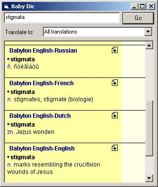



## \[ Babylon \] \(tm\) like dictionary

### Description

Translate words from and to several languages just like Babylon(tm). Capture the Clipboard and translations from and to English, Arabic, Chinese, Chinese (S), Dutch, English, Esperanto, French, German, Greek,

Hebrew, Italian, Japanese, Korean, Portuguese,

Russian, Spanish, Thai, Turkish and much more.

Free Access to all dictionaries from Babylon.com
 
### More Info
 

             |
---                |---
**Submitted On**   |2004-09-28 10:56:44
**By**             |[Carlos Alvarado](https://github.com/Planet-Source-Code/PSCIndex/blob/master/ByAuthor/carlos-alvarado.md)
**Level**          |Intermediate
**User Rating**    |4.3 (43 globes from 10 users)
**Compatibility**  |VB 4\.0 \(16\-bit\), VB 4\.0 \(32\-bit\), VB 5\.0, VB 6\.0
**Category**       |[Miscellaneous](https://github.com/Planet-Source-Code/PSCIndex/blob/master/ByCategory/miscellaneous__1-1.md)
**World**          |[Visual Basic](https://github.com/Planet-Source-Code/PSCIndex/blob/master/ByWorld/visual-basic.md)
**Archive File**   |[\[\_Babylon\_1798359282004\.zip](https://github.com/Planet-Source-Code/carlos-alvarado-babylon-tm-like-dictionary__1-56234/archive/master.zip)

